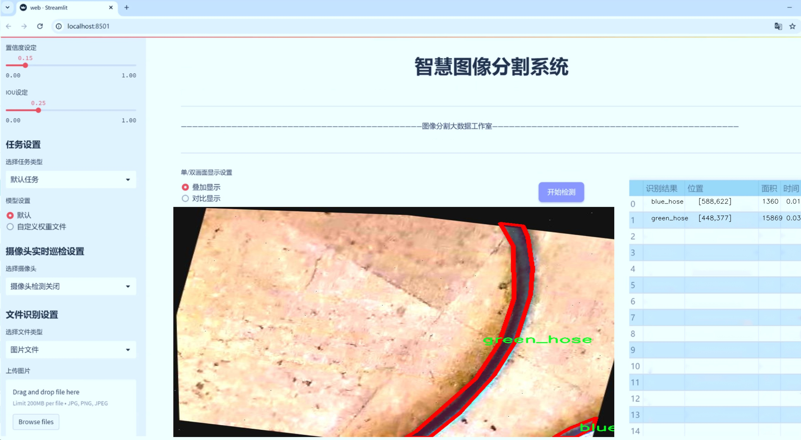

# 管道组件分割系统源码＆数据集分享
 [yolov8-seg-C2f-ContextGuided＆yolov8-seg-bifpn等50+全套改进创新点发刊_一键训练教程_Web前端展示]

### 1.研究背景与意义

项目参考[ILSVRC ImageNet Large Scale Visual Recognition Challenge](https://gitee.com/YOLOv8_YOLOv11_Segmentation_Studio/projects)

项目来源[AAAI Global Al lnnovation Contest](https://kdocs.cn/l/cszuIiCKVNis)

研究背景与意义

随着工业自动化和智能制造的迅速发展，管道系统在各类生产和运输过程中扮演着至关重要的角色。管道组件的有效识别与分割不仅有助于提高生产效率，还能在维护和检修过程中降低人力成本和安全风险。传统的管道组件识别方法多依赖于人工标注和经验判断，存在着效率低、准确性差等问题。因此，基于深度学习的自动化图像分割技术逐渐成为研究的热点。

YOLO（You Only Look Once）系列模型因其高效的实时检测能力而受到广泛关注。特别是YOLOv8，作为该系列的最新版本，结合了多种先进的深度学习技术，能够在复杂场景中实现高精度的目标检测与分割。通过对YOLOv8的改进，针对管道组件的特定需求进行优化，能够显著提升其在工业应用中的实用性。

本研究旨在基于改进的YOLOv8模型，构建一个高效的管道组件分割系统。所使用的数据集包含2700张图像，涵盖了六个类别：Enter、Exit、blue_hose、green_hose、led_strip和red_hose。这些类别的多样性为模型的训练提供了丰富的样本，有助于提高模型的泛化能力和准确性。通过对这些图像进行实例分割，不仅可以实现对各类管道组件的精准识别，还能为后续的智能监控和自动化控制提供数据支持。

在工业环境中，管道组件的种类繁多且形态各异，传统的图像处理方法难以应对这种复杂性。而基于YOLOv8的改进模型，通过引入更深层次的特征提取和多尺度检测机制，能够有效克服这些挑战，实现对不同类别管道组件的高效分割。这不仅提升了系统的识别精度，还为后续的智能决策提供了可靠的数据基础。

此外，管道组件的分割系统在实际应用中具有广泛的意义。首先，它可以应用于管道的自动化检测与监控，实时获取管道状态信息，及时发现潜在的故障隐患。其次，该系统还可以为管道的维护和检修提供决策支持，优化资源配置，降低维护成本。最后，随着智能制造的不断推进，该系统的应用将推动管道管理的智能化和自动化进程，提升整体生产效率。

综上所述，基于改进YOLOv8的管道组件分割系统的研究，不仅具有重要的理论价值，也具有广泛的实际应用前景。通过对该系统的深入研究与开发，将为工业领域的智能化转型提供有力支持，推动相关技术的进步与发展。

### 2.图片演示




##### 注意：由于此博客编辑较早，上面“2.图片演示”和“3.视频演示”展示的系统图片或者视频可能为老版本，新版本在老版本的基础上升级如下：（实际效果以升级的新版本为准）

  （1）适配了YOLOV8的“目标检测”模型和“实例分割”模型，通过加载相应的权重（.pt）文件即可自适应加载模型。

  （2）支持“图片识别”、“视频识别”、“摄像头实时识别”三种识别模式。

  （3）支持“图片识别”、“视频识别”、“摄像头实时识别”三种识别结果保存导出，解决手动导出（容易卡顿出现爆内存）存在的问题，识别完自动保存结果并导出到tempDir中。

  （4）支持Web前端系统中的标题、背景图等自定义修改，后面提供修改教程。

  另外本项目提供训练的数据集和训练教程,暂不提供权重文件（best.pt）,需要您按照教程进行训练后实现图片演示和Web前端界面演示的效果。

### 3.视频演示

[3.1 视频演示](https://www.bilibili.com/video/BV1Nu2pYFEih/)

### 4.数据集信息展示

##### 4.1 本项目数据集详细数据（类别数＆类别名）

nc: 6
names: ['Enter', 'Exit', 'blue_hose', 'green_hose', 'led_strip', 'red_hose']


##### 4.2 本项目数据集信息介绍

数据集信息展示

在现代计算机视觉领域，数据集的构建与选择对于模型的训练和性能优化至关重要。本研究所使用的数据集名为“mergeallrope”，专门用于训练和改进YOLOv8-seg的管道组件分割系统。该数据集的设计旨在提供丰富的视觉信息，以支持对不同管道组件的精确识别和分割，从而提升自动化处理和智能监控的能力。

“mergeallrope”数据集包含六个主要类别，分别为“Enter”、“Exit”、“blue_hose”、“green_hose”、“led_strip”和“red_hose”。这些类别涵盖了管道系统中常见的元素，具有重要的实际应用价值。首先，“Enter”和“Exit”代表了管道系统的入口和出口，这两个类别在管道监控和管理中起着关键作用，能够帮助系统识别流体的进出状态，从而实现对管道流动的有效监控。

其次，数据集中包含的“blue_hose”、“green_hose”和“red_hose”分别代表不同颜色的管道，这些管道在实际应用中可能用于输送不同类型的流体或气体。通过对这些管道的准确分割和识别，系统能够实时监测管道的运行状态，及时发现潜在的泄漏或故障，从而提高管道系统的安全性和可靠性。此外，颜色的多样性也为模型的训练提供了丰富的样本，使得YOLOv8-seg能够在多种环境下进行有效的识别。

最后，“led_strip”类别的引入则为数据集增添了一个重要的视觉元素。LED灯带在现代管道系统中不仅用于照明，还可能作为状态指示灯，显示管道的工作状态或警报信息。通过对LED灯带的分割，系统能够更好地理解管道的运行情况，提供更为全面的监控解决方案。

在数据集的构建过程中，研究团队注重样本的多样性和代表性，确保每个类别的样本数量均衡且具有良好的标注质量。这种精心设计的数据集不仅为YOLOv8-seg的训练提供了坚实的基础，也为后续的模型评估和性能优化奠定了良好的条件。通过对“mergeallrope”数据集的深入分析和应用，研究人员期望能够显著提升管道组件的分割精度，推动智能监控技术的发展。

综上所述，“mergeallrope”数据集以其丰富的类别和高质量的样本，为YOLOv8-seg的管道组件分割系统的训练提供了强有力的支持。随着技术的不断进步和应用场景的扩展，该数据集的价值将愈加凸显，为未来的研究和应用提供更多可能性。


### 5.全套项目环境部署视频教程（零基础手把手教学）

[5.1 环境部署教程链接（零基础手把手教学）](https://www.bilibili.com/video/BV1jG4Ve4E9t/?vd_source=bc9aec86d164b67a7004b996143742dc)


[5.2 安装Python虚拟环境创建和依赖库安装视频教程链接（零基础手把手教学）](https://www.bilibili.com/video/BV1nA4VeYEze/?vd_source=bc9aec86d164b67a7004b996143742dc)

### 6.手把手YOLOV8-seg训练视频教程（零基础小白有手就能学会）

[6.1 手把手YOLOV8-seg训练视频教程（零基础小白有手就能学会）](https://www.bilibili.com/video/BV1cA4VeYETe/?vd_source=bc9aec86d164b67a7004b996143742dc)


按照上面的训练视频教程链接加载项目提供的数据集，运行train.py即可开始训练



     Epoch   gpu_mem       box       obj       cls    labels  img_size
     1/200     0G   0.01576   0.01955  0.007536        22      1280: 100%|██████████| 849/849 [14:42<00:00,  1.04s/it]
               Class     Images     Labels          P          R     mAP@.5 mAP@.5:.95: 100%|██████████| 213/213 [01:14<00:00,  2.87it/s]
                 all       3395      17314      0.994      0.957      0.0957      0.0843

     Epoch   gpu_mem       box       obj       cls    labels  img_size
     2/200     0G   0.01578   0.01923  0.007006        22      1280: 100%|██████████| 849/849 [14:44<00:00,  1.04s/it]
               Class     Images     Labels          P          R     mAP@.5 mAP@.5:.95: 100%|██████████| 213/213 [01:12<00:00,  2.95it/s]
                 all       3395      17314      0.996      0.956      0.0957      0.0845

     Epoch   gpu_mem       box       obj       cls    labels  img_size
     3/200     0G   0.01561    0.0191  0.006895        27      1280: 100%|██████████| 849/849 [10:56<00:00,  1.29it/s]
               Class     Images     Labels          P          R     mAP@.5 mAP@.5:.95: 100%|███████   | 187/213 [00:52<00:00,  4.04it/s]
                 all       3395      17314      0.996      0.957      0.0957      0.0845


### 7.50+种全套YOLOV8-seg创新点代码加载调参视频教程（一键加载写好的改进模型的配置文件）

[7.1 50+种全套YOLOV8-seg创新点代码加载调参视频教程（一键加载写好的改进模型的配置文件）](https://www.bilibili.com/video/BV1Hw4VePEXv/?vd_source=bc9aec86d164b67a7004b996143742dc)

### 8.YOLOV8-seg图像分割算法原理

原始YOLOv8-seg算法原理

YOLOv8-seg是YOLO系列中的最新进展，代表了目标检测与分割技术的前沿。该算法不仅在检测精度和速度上相较于前代版本有了显著提升，还在分割任务中展现了其独特的优势。YOLOv8-seg的设计理念是将目标检测与实例分割有效结合，使得模型能够在处理复杂场景时，既能准确识别目标，又能提供精细的分割结果。

YOLOv8-seg的网络结构主要由输入端、骨干网络、颈部网络和头部网络四个部分组成。输入端负责对输入图像进行预处理，包括马赛克数据增强、自适应锚框计算和自适应灰度填充等。这些步骤旨在提升模型的鲁棒性，使其在不同光照、视角和背景下均能保持良好的性能。马赛克增强技术通过将多张图像拼接在一起，增加了训练数据的多样性，从而有效防止过拟合现象。

在骨干网络部分，YOLOv8-seg采用了C2f和SPPF结构。C2f模块通过丰富的分支跨层连接，增强了模型的梯度流，提升了特征的表示能力。这一设计灵感来源于YOLOv7的ELAN结构，使得网络在提取特征时能够更好地捕捉到不同层次的信息。此外，SPPF模块通过空间金字塔池化融合多尺度特征，进一步增强了网络对不同尺寸目标的适应能力。这种特征提取方式使得YOLOv8-seg在面对复杂场景时，能够有效地识别和分割出目标。

颈部网络采用了路径聚合网络（PAN）结构，旨在加强不同尺度特征的融合能力。通过这种结构，YOLOv8-seg能够在处理多尺度目标时，充分利用来自不同层次的特征信息，确保在目标检测和分割过程中，信息的完整性和准确性。这一设计在实际应用中尤为重要，因为现实场景中的目标往往具有不同的尺寸和形状，PAN结构的引入使得模型在面对这些挑战时，能够表现得更加从容。

头部网络则是YOLOv8-seg的核心部分，负责最终的目标检测和分割任务。与传统的耦合头结构不同，YOLOv8-seg采用了解耦的检测头，通过两个并行的卷积分支分别计算回归和分类的损失。这种设计不仅提高了模型的灵活性，还加速了非最大抑制（NMS）过程，减少了计算量，从而提升了整体的检测速度。在损失计算方面，YOLOv8-seg引入了Task-Aligned Assigner策略，根据分类与回归的分数加权结果选择正样本。这一策略的引入，使得模型在训练过程中能够更好地平衡正负样本的分配，提高了检测的精度。

YOLOv8-seg在目标分割方面的表现尤为突出。通过将传统的锚框检测方法替换为无锚框检测头，YOLOv8-seg减少了锚框预测的数量，简化了模型的复杂性，同时提高了分割的精度。这一创新使得YOLOv8-seg在处理复杂背景和多目标场景时，能够更准确地分割出目标区域，尤其是在边界模糊或重叠的情况下，表现得尤为出色。

在实际应用中，YOLOv8-seg可以广泛应用于智能监控、自动驾驶、医学影像分析等多个领域。其强大的实时性和高精度，使得它在需要快速反应和准确识别的场景中，成为了一个理想的选择。例如，在自动驾驶领域，YOLOv8-seg能够实时识别道路上的行人、车辆和交通标志，并对其进行精确的分割，为自动驾驶系统提供重要的决策依据。

总的来说，YOLOv8-seg通过其先进的网络结构和创新的设计理念，在目标检测与分割领域树立了新的标杆。其在精度和速度上的双重提升，使得YOLOv8-seg不仅能够满足现代应用的需求，更为未来的研究和应用提供了广阔的空间。随着技术的不断进步，YOLOv8-seg有望在更多的实际场景中发挥重要作用，推动计算机视觉领域的进一步发展。


### 9.系统功能展示（检测对象为举例，实际内容以本项目数据集为准）

图9.1.系统支持检测结果表格显示

  图9.2.系统支持置信度和IOU阈值手动调节

  图9.3.系统支持自定义加载权重文件best.pt(需要你通过步骤5中训练获得)

  图9.4.系统支持摄像头实时识别

  图9.5.系统支持图片识别

  图9.6.系统支持视频识别

  图9.7.系统支持识别结果文件自动保存

  图9.8.系统支持Excel导出检测结果数据


### 10.50+种全套YOLOV8-seg创新点原理讲解（非科班也可以轻松写刊发刊，V11版本正在科研待更新）

#### 10.1 由于篇幅限制，每个创新点的具体原理讲解就不一一展开，具体见下列网址中的创新点对应子项目的技术原理博客网址【Blog】：


[10.1 50+种全套YOLOV8-seg创新点原理讲解链接](https://gitee.com/qunmasj/good)

#### 10.2 部分改进模块原理讲解(完整的改进原理见上图和技术博客链接)【此小节的图要是加载失败请移步原始博客查看，链接：https://blog.csdn.net/cheng2333333?type=blog】
### 可变性卷积DCN简介
卷积神经网络由于其构建模块中固定的几何结构，本质上受限于模型几何变换。为了提高卷积神经网络的转换建模能力，《Deformable Convolutional Networks》作者提出了两个模块：可变形卷积（deformable convolution）和可变形RoI池（deformable RoI pooling）。这两个模块均基于用额外的偏移来增加模块中的空间采样位置以及从目标任务中学习偏移的思想，而不需要额外的监督。

第一次证明了在深度神经网络中学习密集空间变换（dense spatial transformation）对于复杂的视觉任务是有效的

视觉识别中的一个关键挑战是如何适应对象比例、姿态、视点和零件变形中的几何变化或模型几何变换。一般有两种方法实现：
1）建立具有足够期望变化的训练数据集。这通常通过增加现有的数据样本来实现，例如通过仿射变换。但是训练成本昂贵而且模型参数庞大。
2）使用变换不变（transformation-invariant）的特征和算法。比如比较有名的SIFT(尺度不变特征变换)便是这一类的代表算法。

但以上的方法有两个缺点：
1）几何变换被假定为固定的和已知的，这些先验知识被用来扩充数据，设计特征和算法。为此，这个假设阻止了对具有未知几何变换的新任务的推广，从而导致这些几何变换可能没有被正确建模。
2）对于不变特征和算法进行手动设计，对于过于复杂的变换可能是困难的或不可行的。

卷积神经网络本质上局限于模拟大型未知转换。局限性源于CNN模块的固定几何结构：卷积单元在固定位置对输入特征图进行采样；池化层以固定比率降低特征矩阵分辨率；RoI（感兴趣区域）池化层将RoI分成固定的空间箱（spatial bins）等。缺乏处理几何变换的内部机制。

这种内部机制的缺乏会导致一些问题，举个例子。同一个CNN层中所有激活单元的感受野大小是相同的，但是这是不可取的。因为不同的位置可能对应于具有不同尺度或变形的对象，所以尺度或感受野大小的自适应确定对于具有精细定位的视觉识别是渴望的。

对于这些问题，作者提出了两个模块提高CNNs对几何变换建模的能力。


deformable convolution（可变形卷积）
将2D偏移量添加到标准卷积中的常规网格采样位置，使得采样网格能够自由变形。通过额外的卷积层，从前面的特征映射中学习偏移。因此，变形采用局部、密集和自适应的方式取决于输入特征。


deformable RoI pooling（可变形RoI池化）
为先前RoI池化的常规库（bin）分区中的每个库位置（bin partition）增加了一个偏移量。类似地，偏移是从前面的特征图和感兴趣区域中学习的，从而能够对具有不同形状的对象进行自适应部件定位（adaptive part localization）。

#### Deformable Convolutional Networks
Deformable Convolution
2D卷积由两个步骤组成：
1）在输入特征图x xx上使用规则网格R RR进行采样。
2）把这些采样点乘不同权重w ww后相加。

网格R定义感受野大小和扩张程度，比如内核大小为3x3，扩张程度为1的网格R可以表示为：
R = { ( − 1 , − 1 ) , ( − 1 , 0 ) , … , ( 0 , 1 ) , ( 1 , 1 ) } R = \{(-1,-1),(-1,0),\dots,(0,1),(1,1)\}
R={(−1,−1),(−1,0),…,(0,1),(1,1)}

​
 一般为小数，使用双线性插值进行处理。（把小数坐标分解到相邻的四个整数坐标点来计算结果）


具体操作如图所示：


首先对输入特征层进行一个普通的3x3卷积处理得到偏移域（offset field）。偏移域特征图具有与输入特征图相同的空间分辨率，channels维度2N对应于N个2D（xy两个方向）偏移。其中的N是原输入特征图上所具有的N个channels，也就是输入输出channels保持不变，这里xy两个channels分别对输出特征图上的一个channels进行偏移。确定采样点后就通过与相对应的权重w点乘相加得到输出特征图上该点最终值。

前面也提到过，由于这里xy两个方向所训练出来的偏移量一般来说是一个小数，那么为了得到这个点所对应的数值，会采用双线性插值的方法，从最近的四个邻近坐标点中计算得到该偏移点的数值，公式如下：


具体推理过程见：双线性插值原理

#### Deformable RoI Poolingb
所有基于区域提议（RPN）的对象检测方法都使用RoI池话处理，将任意大小的输入矩形区域转换为固定大小的特征图。


 一般为小数，需要使用双线性插值进行处理。


具体操作如图所示：


当时看这个部分的时候觉得有些突兀，明明RoI池化会将特征层转化为固定尺寸的区域。其实，我个人觉得，这个部分与上述的可变性卷积操作是类似的。这里同样是使用了一个普通的RoI池化操作，进行一些列处理后得到了一个偏移域特征图，然后重新作用于原来的w × H w \times Hw×H的RoI。只不过这里不再是规律的逐行逐列对每个格子进行池化，而是对于格子进行偏移后再池化处理。

#### Postion﹣Sensitive RoI Pooling
除此之外，论文还提出一种PS RoI池化（Postion﹣Sensitive RoI Pooling）。不同于上述可变形RoI池化中的全连接过程，这里使用全卷积替换。

具体操作如图所示：


首先，对于原来的特征图来说，原本是将输入特征图上的RoI区域分成k × k k\times kk×k个bin。而在这里，则是将输入特征图进行卷积操作，分别得到一个channels为k 2 ( C + 1 ) k^{2}(C+1)k (C+1)的得分图（score maps）和一个channels为2 k 2 ( C + 1 ) 2k{2}(C+1)2k 2 (C+1)的偏移域（offset fields），这两个特征矩阵的宽高是与输入特征矩阵相同的。其中，得分图的channels中，k × k k \times kk×k分别表示的是每一个网格，C CC表示的检测对象的类别数目，1表示背景。而在偏移域中的2表示xy两个方向的偏移。
也就是说，在PS RoI池化中，对于RoI的每一个网格都独自占一个通道形成一层得分图，然后其对于的偏移量占两个通道。offset fields得到的偏移是归一化后的偏移，需要通过和deformable RoI pooling中一样的变换方式得到∆ p i j ∆p_{ij}∆p ij，然后对每层得分图进行偏移池化处理。最后处理完的结果就对应着最后输出的一个网格。所以其包含了位置信息。

原文论述为：


#### Understanding Deformable ConvNets
当可变形卷积叠加时，复合变形的效果是深远的。如图所示：


ps：a是标准卷积的固定感受野，b是可变形卷积的适应性感受野。

感受野和标准卷积中的采样位置在整个顶部特征图上是固定的(左)。在可变形卷积中，它们根据对象的比例和形状进行自适应调整(右)。


### 11.项目核心源码讲解（再也不用担心看不懂代码逻辑）

#### 11.1 ultralytics\utils\checks.py

以下是经过简化和注释的核心代码部分，保留了最重要的功能，并对每个函数进行了详细的中文注释：

```python
import os
import re
import subprocess
import sys
from pathlib import Path
from typing import Optional

import torch
from ultralytics.utils import LOGGER, ROOT, SimpleNamespace

def parse_requirements(file_path=ROOT.parent / 'requirements.txt', package=''):
    """
    解析 requirements.txt 文件，忽略以 '#' 开头的行和 '#' 后的文本。

    参数:
        file_path (Path): requirements.txt 文件的路径。
        package (str, optional): 要使用的 Python 包名。

    返回:
        (List[Dict[str, str]]): 解析后的需求列表，每个需求为字典形式，包含 `name` 和 `specifier` 键。
    """
    if package:
        requires = [x for x in metadata.distribution(package).requires if 'extra == ' not in x]
    else:
        requires = Path(file_path).read_text().splitlines()

    requirements = []
    for line in requires:
        line = line.strip()
        if line and not line.startswith('#'):
            line = line.split('#')[0].strip()  # 忽略行内注释
            match = re.match(r'([a-zA-Z0-9-_]+)\s*([<>!=~]+.*)?', line)
            if match:
                requirements.append(SimpleNamespace(name=match[1], specifier=match[2].strip() if match[2] else ''))

    return requirements


def check_version(current: str = '0.0.0', required: str = '0.0.0', name: str = 'version', hard: bool = False) -> bool:
    """
    检查当前版本是否满足所需版本或范围。

    参数:
        current (str): 当前版本。
        required (str): 所需版本或范围（以 pip 风格格式）。
        name (str, optional): 用于警告消息的名称。
        hard (bool, optional): 如果为 True，当要求不满足时引发 AssertionError。

    返回:
        (bool): 如果满足要求则返回 True，否则返回 False。
    """
    if not current:  # 如果 current 是 '' 或 None
        LOGGER.warning(f'WARNING ⚠️ invalid check_version({current}, {required}) requested, please check values.')
        return True

    result = True
    c = parse_version(current)  # 将版本字符串解析为元组
    for r in required.strip(',').split(','):
        op, v = re.match(r'([^0-9]*)([\d.]+)', r).groups()  # 分离操作符和版本号
        v = parse_version(v)  # 将版本字符串解析为元组
        if op == '==' and c != v:
            result = False
        elif op == '!=' and c == v:
            result = False
        elif op in ('>=', '') and not (c >= v):
            result = False
        elif op == '<=' and not (c <= v):
            result = False
        elif op == '>' and not (c > v):
            result = False
        elif op == '<' and not (c < v):
            result = False

    if not result:
        warning_message = f'WARNING ⚠️ {name}{op}{required} is required, but {name}=={current} is currently installed'
        if hard:
            raise ModuleNotFoundError(warning_message)  # 如果不满足要求，抛出异常
        LOGGER.warning(warning_message)
    return result


def check_python(minimum: str = '3.8.0') -> bool:
    """
    检查当前 Python 版本是否满足所需的最低版本。

    参数:
        minimum (str): 所需的最低 Python 版本。

    返回:
        None
    """
    return check_version(platform.python_version(), minimum, name='Python ', hard=True)


def check_file(file, suffix='', download=True, hard=True):
    """检查文件是否存在，如果不存在则下载并返回路径。"""
    check_suffix(file, suffix)  # 可选的后缀检查
    file = str(file).strip()  # 转换为字符串并去除空格
    if not file or Path(file).exists():  # 如果文件存在，直接返回
        return file
    elif download and file.lower().startswith(('https://', 'http://')):  # 如果是 URL，则下载
        url = file
        file = url2file(file)  # 下载文件
        return file
    else:  # 搜索文件
        files = glob.glob(str(ROOT / '**' / file), recursive=True)  # 查找文件
        if not files and hard:
            raise FileNotFoundError(f"'{file}' does not exist")
        return files[0] if len(files) else []  # 返回找到的文件


def check_requirements(requirements=ROOT.parent / 'requirements.txt', exclude=(), install=True):
    """
    检查已安装的依赖项是否满足要求，并尝试自动更新。

    参数:
        requirements (Union[Path, str, List[str]]): requirements.txt 文件的路径，单个包要求字符串，或包要求字符串列表。
        exclude (Tuple[str]): 要排除的包名元组。
        install (bool): 如果为 True，尝试自动更新不满足要求的包。

    返回:
        (bool): 如果所有要求都满足则返回 True，否则返回 False。
    """
    check_python()  # 检查 Python 版本
    if isinstance(requirements, Path):  # 如果是 requirements.txt 文件
        file = requirements.resolve()
        assert file.exists(), f'requirements file {file} not found, check failed.'
        requirements = [f'{x.name}{x.specifier}' for x in parse_requirements(file) if x.name not in exclude]
    elif isinstance(requirements, str):
        requirements = [requirements]

    pkgs = []
    for r in requirements:
        r_stripped = r.split('/')[-1].replace('.git', '')  # 处理 git 链接
        match = re.match(r'([a-zA-Z0-9-_]+)([<>!=~]+.*)?', r_stripped)
        name, required = match[1], match[2].strip() if match[2] else ''
        try:
            assert check_version(metadata.version(name), required)  # 检查版本
        except (AssertionError, metadata.PackageNotFoundError):
            pkgs.append(r)

    if pkgs and install:  # 如果有未满足的包并且允许安装
        s = ' '.join(f'"{x}"' for x in pkgs)  # 控制台字符串
        LOGGER.info(f"Ultralytics requirements {pkgs} not found, attempting AutoUpdate...")
        try:
            assert is_online(), 'AutoUpdate skipped (offline)'
            subprocess.check_output(f'pip install --no-cache {s}', shell=True)  # 自动更新
            LOGGER.info(f"AutoUpdate success ✅, installed {len(pkgs)} packages: {pkgs}")
        except Exception as e:
            LOGGER.warning(f'AutoUpdate failed ❌: {e}')
            return False

    return True
```

### 代码核心功能说明：
1. **解析需求**：`parse_requirements` 函数用于解析 requirements.txt 文件，提取出需要的包及其版本信息。
2. **版本检查**：`check_version` 函数用于检查当前版本是否满足要求的版本。
3. **Python 版本检查**：`check_python` 函数确保当前 Python 版本符合最低要求。
4. **文件检查**：`check_file` 函数检查指定文件是否存在，若不存在则尝试下载。
5. **依赖检查**：`check_requirements` 函数检查已安装的依赖是否满足要求，并在需要时尝试自动更新。

以上是代码的核心部分及其功能的详细注释。

该文件 `ultralytics/utils/checks.py` 是 Ultralytics YOLO 项目中的一个实用工具模块，主要用于检查和验证各种依赖、版本、文件和环境设置，以确保 YOLO 模型的正常运行。以下是对文件中各个部分的详细讲解。

首先，文件导入了一系列必要的库，包括标准库和第三方库，如 `cv2`、`numpy`、`requests` 和 `torch`。这些库为后续的功能提供了支持。

接下来，定义了一些函数：

1. **`parse_requirements`**：解析 `requirements.txt` 文件，提取其中的依赖项，并返回一个包含包名和版本规范的字典列表。该函数可以处理注释和空行，确保只返回有效的依赖项。

2. **`parse_version`**：将版本字符串转换为整数元组，方便进行版本比较。它会忽略任何非数字字符，并在解析失败时返回默认值 `(0, 0, 0)`。

3. **`is_ascii`**：检查字符串是否仅由 ASCII 字符组成。

4. **`check_imgsz`**：验证图像尺寸是否为给定步幅的倍数，并在必要时调整图像尺寸，以确保其符合要求。

5. **`check_version`**：检查当前版本是否满足所需版本或版本范围，并根据参数决定是否抛出异常或打印警告信息。

6. **`check_latest_pypi_version`**：获取 PyPI 上某个包的最新版本信息，而不进行下载或安装。

7. **`check_pip_update_available`**：检查是否有新版本的 Ultralytics 包可用，并在有更新时打印相关信息。

8. **`check_font`**：检查本地是否存在指定字体，如果不存在则从指定 URL 下载到用户配置目录。

9. **`check_python`**：检查当前 Python 版本是否满足最低要求。

10. **`check_requirements`**：检查安装的依赖项是否满足 YOLOv8 的要求，并在需要时尝试自动更新。

11. **`check_torchvision`**：检查 PyTorch 和 Torchvision 的版本兼容性，并根据预定义的兼容性表发出警告。

12. **`check_suffix`**：检查文件是否具有有效的后缀。

13. **`check_yolov5u_filename`**：将旧版 YOLOv5 文件名替换为更新的 YOLOv5u 文件名。

14. **`check_file`**：检查文件是否存在，如果不存在则尝试下载或搜索。

15. **`check_yaml`**：检查 YAML 文件的存在性和后缀。

16. **`check_imshow`**：检查当前环境是否支持图像显示。

17. **`check_yolo`**：返回 YOLO 软件和硬件的可读性摘要，并打印系统信息。

18. **`collect_system_info`**：收集并打印相关的系统信息，包括操作系统、Python 版本、内存、CPU 和 CUDA 信息。

19. **`check_amp`**：检查 PyTorch 自动混合精度（AMP）功能是否正常工作。

20. **`git_describe`**：返回可读的 Git 描述信息。

21. **`print_args`**：打印函数参数，支持从调用栈中自动获取参数。

22. **`cuda_device_count`**：获取可用的 NVIDIA GPU 数量。

23. **`cuda_is_available`**：检查环境中是否可用 CUDA。

该模块的设计旨在确保在使用 YOLO 模型时，所有必要的依赖和环境设置都是正确的，避免因版本不兼容或缺少依赖而导致的运行错误。通过这些检查，用户可以更轻松地配置和使用 YOLO 模型。

#### 11.2 ultralytics\models\yolo\classify\__init__.py

```python
# 导入Ultralytics YOLO库中的分类模型相关模块
# Ultralytics YOLO 🚀, AGPL-3.0 license

# 导入分类预测器，用于进行图像分类的预测
from ultralytics.models.yolo.classify.predict import ClassificationPredictor

# 导入分类训练器，用于训练分类模型
from ultralytics.models.yolo.classify.train import ClassificationTrainer

# 导入分类验证器，用于验证分类模型的性能
from ultralytics.models.yolo.classify.val import ClassificationValidator

# 定义模块的公开接口，包含分类预测器、训练器和验证器
__all__ = 'ClassificationPredictor', 'ClassificationTrainer', 'ClassificationValidator'
```

### 代码注释说明：
1. **导入模块**：
   - `ClassificationPredictor`：用于进行图像分类的预测，能够对输入的图像进行分类并返回结果。
   - `ClassificationTrainer`：用于训练分类模型，提供训练过程中的各种功能和参数设置。
   - `ClassificationValidator`：用于验证训练好的分类模型的性能，评估模型在验证集上的表现。

2. **公开接口**：
   - `__all__`：定义了模块的公开接口，指定了可以被外部访问的类或函数。在这里，只有`ClassificationPredictor`、`ClassificationTrainer`和`ClassificationValidator`这三个类可以被导入和使用。

这个程序文件是一个Python模块的初始化文件，位于Ultralytics YOLO项目的分类模型目录下。文件的主要功能是导入与分类相关的类，并定义了模块的公共接口。

首先，文件顶部的注释表明该项目是Ultralytics YOLO的一部分，并且使用AGPL-3.0许可证。这是一个开源许可证，允许用户自由使用、修改和分发软件，但要求任何派生作品也必须在相同的许可证下发布。

接下来，文件通过`from`语句导入了三个类：`ClassificationPredictor`、`ClassificationTrainer`和`ClassificationValidator`。这些类分别用于分类任务中的预测、训练和验证。具体来说：

- `ClassificationPredictor`类负责在模型训练完成后进行图像分类的预测。
- `ClassificationTrainer`类用于处理模型的训练过程，包括数据加载、模型优化等。
- `ClassificationValidator`类则用于验证模型的性能，通常是在训练后对模型进行评估。

最后，`__all__`变量定义了模块的公共接口，指定了当使用`from module import *`语句时，哪些名称会被导入。这里列出的三个类都将被视为模块的公共部分，方便用户在使用该模块时直接访问。

总的来说，这个初始化文件为分类模型的使用提供了一个清晰的接口，使得其他模块或用户能够方便地导入和使用分类相关的功能。

#### 11.3 ui.py

以下是代码中最核心的部分，并附上详细的中文注释：

```python
import sys
import subprocess

def run_script(script_path):
    """
    使用当前 Python 环境运行指定的脚本。

    Args:
        script_path (str): 要运行的脚本路径

    Returns:
        None
    """
    # 获取当前 Python 解释器的路径
    python_path = sys.executable

    # 构建运行命令，使用 streamlit 运行指定的脚本
    command = f'"{python_path}" -m streamlit run "{script_path}"'

    # 执行命令，使用 subprocess.run 来运行构建的命令
    result = subprocess.run(command, shell=True)
    
    # 检查命令执行的返回码，如果不为0，表示执行出错
    if result.returncode != 0:
        print("脚本运行出错。")

# 实例化并运行应用
if __name__ == "__main__":
    # 指定要运行的脚本路径
    script_path = "web.py"  # 这里可以直接指定脚本路径

    # 调用函数运行指定的脚本
    run_script(script_path)
```

### 代码注释说明：
1. **导入模块**：
   - `sys`：用于访问与 Python 解释器紧密相关的变量和函数。
   - `subprocess`：用于执行外部命令和程序。

2. **`run_script` 函数**：
   - 定义了一个函数，接受一个参数 `script_path`，表示要运行的 Python 脚本的路径。
   - 使用 `sys.executable` 获取当前 Python 解释器的路径，以确保使用正确的 Python 环境。
   - 构建一个命令字符串，使用 `streamlit` 模块运行指定的脚本。
   - 使用 `subprocess.run` 执行构建的命令，并通过 `shell=True` 允许在 shell 中执行。
   - 检查命令的返回码，如果返回码不为0，表示脚本运行出错，并打印错误信息。

3. **主程序块**：
   - 使用 `if __name__ == "__main__":` 确保该代码块仅在直接运行脚本时执行。
   - 指定要运行的脚本路径为 `web.py`。
   - 调用 `run_script` 函数，传入脚本路径以执行该脚本。

这个程序文件的主要功能是通过当前的 Python 环境来运行一个指定的脚本，具体来说是一个名为 `web.py` 的脚本。程序首先导入了必要的模块，包括 `sys`、`os` 和 `subprocess`，以及一个自定义的 `abs_path` 函数，这个函数可能用于获取脚本的绝对路径。

在 `run_script` 函数中，首先获取当前 Python 解释器的路径，这样可以确保在正确的环境中运行脚本。接着，构建一个命令字符串，该命令使用 `streamlit` 来运行指定的脚本。`streamlit` 是一个用于构建数据应用的框架，通常用于快速创建交互式的 Web 应用。

然后，使用 `subprocess.run` 方法来执行这个命令。这个方法会在一个新的进程中运行命令，并等待其完成。如果脚本运行过程中出现错误，返回的状态码将不为零，程序会打印出“脚本运行出错”的提示。

在文件的最后部分，使用 `if __name__ == "__main__":` 语句来确保只有在直接运行这个文件时才会执行下面的代码。这里指定了要运行的脚本路径 `web.py`，并调用 `run_script` 函数来执行这个脚本。

总体来说，这个程序是一个简单的脚本执行器，专门用于在当前 Python 环境中运行一个 Streamlit 应用脚本。

#### 11.4 chinese_name_list.py

以下是经过简化并添加详细中文注释的核心代码部分：

```python
# -*- coding: utf-8 -*-

# 创建一个字典，包含中文名称
Chinese_name = {'person': "人"}

# 从字典中提取所有值，生成一个列表
Label_list = list(Chinese_name.values())

# 现在 Label_list 中包含了字典 Chinese_name 的所有值
# 在这个例子中，Label_list 将是 ["人"]
```

### 代码说明：
1. `# -*- coding: utf-8 -*-`：这行代码指定了文件的编码格式为 UTF-8，确保可以正确处理中文字符。
2. `Chinese_name = {'person': "人"}`：定义一个字典 `Chinese_name`，其中键为 `'person'`，值为中文字符 `"人"`。
3. `Label_list = list(Chinese_name.values())`：使用 `values()` 方法提取字典中的所有值，并将其转换为列表，赋值给 `Label_list`。在这个例子中，`Label_list` 将包含一个元素，即 `"人"`。

这个程序文件的名称是 `chinese_name_list.py`，它的主要功能是定义一个包含中文名称的字典，并从中提取出所有的值，存储到一个列表中。

首先，文件的开头有一行注释 `# -*- coding: utf-8 -*-`，这表示文件使用 UTF-8 编码。这种编码方式能够支持多种语言的字符，特别是中文字符。

接下来，程序定义了一个字典 `Chinese_name`，这个字典只有一个键值对，其中键是 `'person'`，对应的值是 `"人"`。这个字典的目的是为了存储中文名称，当前只包含一个与“人”相关的中文词汇。

然后，程序通过 `list(Chinese_name.values())` 这一行代码，从字典 `Chinese_name` 中提取出所有的值，并将这些值转换成一个列表。这里的 `values()` 方法会返回字典中所有的值，而 `list()` 函数则将这些值转换为列表格式。最终，提取出的值会被存储在 `Label_list` 变量中。

总结来说，这段代码的作用是创建一个包含中文名称的字典，并将字典中的值提取到一个列表中，方便后续使用。当前的实现比较简单，只包含一个中文词汇，但可以根据需要扩展更多的键值对。

#### 11.5 ultralytics\utils\callbacks\dvc.py

以下是经过简化并添加详细中文注释的核心代码部分：

```python
# 导入必要的库
from ultralytics.utils import LOGGER, SETTINGS, TESTS_RUNNING, checks

try:
    # 确保当前不是在测试环境中
    assert not TESTS_RUNNING  
    # 确保DVC集成已启用
    assert SETTINGS['dvc'] is True  
    import dvclive  # 导入DVCLive库
    # 检查DVCLive版本
    assert checks.check_version('dvclive', '2.11.0', verbose=True)

    import os
    import re
    from pathlib import Path

    # DVCLive日志记录实例
    live = None
    _processed_plots = {}  # 记录已处理的图表

    # 用于区分最佳模型的最终评估与最后一个epoch验证的标志
    _training_epoch = False

except (ImportError, AssertionError, TypeError):
    dvclive = None  # 如果导入失败，则将dvclive设置为None


def _log_images(path, prefix=''):
    """记录指定路径的图像，使用DVCLive进行日志记录。"""
    if live:  # 如果DVCLive实例存在
        name = path.name

        # 根据批次分组图像，以便在UI中启用滑块
        m = re.search(r'_batch(\d+)', name)
        if m:
            ni = m[1]
            new_stem = re.sub(r'_batch(\d+)', '_batch', path.stem)
            name = (Path(new_stem) / ni).with_suffix(path.suffix)

        # 记录图像
        live.log_image(os.path.join(prefix, name), path)


def on_train_start(trainer):
    """如果DVCLive日志记录处于活动状态，则记录训练参数。"""
    if live:
        live.log_params(trainer.args)  # 记录训练参数


def on_fit_epoch_end(trainer):
    """在每个fit epoch结束时记录训练指标和模型信息。"""
    global _training_epoch
    if live and _training_epoch:  # 如果DVCLive实例存在且正在训练epoch
        all_metrics = {**trainer.label_loss_items(trainer.tloss, prefix='train'), **trainer.metrics, **trainer.lr}
        for metric, value in all_metrics.items():
            live.log_metric(metric, value)  # 记录每个指标

        # 记录模型信息
        if trainer.epoch == 0:
            from ultralytics.utils.torch_utils import model_info_for_loggers
            for metric, value in model_info_for_loggers(trainer).items():
                live.log_metric(metric, value, plot=False)

        live.next_step()  # 进行到下一步
        _training_epoch = False  # 重置训练epoch标志


def on_train_end(trainer):
    """在训练结束时记录最佳指标、图表和混淆矩阵。"""
    if live:
        # 记录最佳指标
        all_metrics = {**trainer.label_loss_items(trainer.tloss, prefix='train'), **trainer.metrics, **trainer.lr}
        for metric, value in all_metrics.items():
            live.log_metric(metric, value, plot=False)

        # 记录混淆矩阵
        _log_confusion_matrix(trainer.validator)

        live.end()  # 结束日志记录


# 定义回调函数字典
callbacks = {
    'on_train_start': on_train_start,
    'on_fit_epoch_end': on_fit_epoch_end,
    'on_train_end': on_train_end
} if dvclive else {}
```

### 代码说明：
1. **导入库**：导入必要的库和模块，包括`ultralytics`和`dvclive`，用于日志记录和模型训练。
2. **全局变量**：定义了`live`用于存储DVCLive实例，`_processed_plots`用于跟踪已处理的图表，`_training_epoch`用于指示当前是否在训练epoch中。
3. **图像记录函数**：`_log_images`函数用于记录训练过程中生成的图像，支持批次分组以便在UI中展示。
4. **训练开始回调**：`on_train_start`函数在训练开始时记录训练参数。
5. **训练结束回调**：`on_fit_epoch_end`函数在每个训练epoch结束时记录训练指标，并在训练结束时记录最佳指标和混淆矩阵。

这个程序文件是一个用于Ultralytics YOLO（目标检测模型）训练过程中的回调函数实现，主要用于集成DVCLive，一个用于机器学习实验的实时日志记录工具。代码的结构和功能如下：

首先，程序通过导入必要的模块和库来设置环境，包括日志记录器、设置项和一些检查函数。它会检查当前是否在运行测试，并确认DVCLive集成是否启用。如果导入DVCLive失败或设置不正确，程序会将`dvclive`设置为`None`，从而避免后续调用时出错。

接下来，定义了一些私有函数来处理图像和绘图的日志记录。`_log_images`函数用于记录指定路径下的图像，并在图像名称中添加前缀。`_log_plots`函数则用于记录训练过程中的绘图，如果这些绘图尚未被处理过。`_log_confusion_matrix`函数用于记录混淆矩阵，这对于评估模型的分类性能非常重要。

然后，定义了一系列回调函数，这些函数在训练的不同阶段被调用。`on_pretrain_routine_start`函数在预训练开始时初始化DVCLive日志记录器，并记录相关信息。`on_pretrain_routine_end`函数在预训练结束时记录训练过程中的绘图。`on_train_start`函数在训练开始时记录训练参数。`on_train_epoch_start`函数在每个训练周期开始时设置一个全局变量，标记当前为训练周期。

`on_fit_epoch_end`函数在每个训练周期结束时记录训练指标和模型信息，并推进到下一个步骤。最后，`on_train_end`函数在训练结束时记录最佳指标、绘图和混淆矩阵，并结束DVCLive的日志记录。

最后，程序将这些回调函数组织成一个字典，方便在训练过程中根据DVCLive的状态调用相应的函数。

总体而言，这个文件的主要功能是通过DVCLive记录YOLO模型训练过程中的各种信息，以便于后续的分析和可视化。

#### 11.6 train.py

以下是代码中最核心的部分，并附上详细的中文注释：

```python
import os
import torch
import yaml
from ultralytics import YOLO  # 导入YOLO模型库

if __name__ == '__main__':  # 确保该模块被直接运行时才执行以下代码
    # 设置训练参数
    workers = 1  # 数据加载的工作进程数
    batch = 8  # 每个批次的样本数量，视显存情况调整
    device = "0" if torch.cuda.is_available() else "cpu"  # 判断是否使用GPU

    # 获取数据集配置文件的绝对路径
    data_path = abs_path(f'datasets/data/data.yaml', path_type='current')

    # 读取YAML文件，保持原有顺序
    with open(data_path, 'r') as file:
        data = yaml.load(file, Loader=yaml.FullLoader)

    # 修改数据集路径
    if 'train' in data and 'val' in data and 'test' in data:
        directory_path = os.path.dirname(data_path.replace(os.sep, '/'))  # 获取目录路径
        data['train'] = directory_path + '/train'  # 设置训练集路径
        data['val'] = directory_path + '/val'      # 设置验证集路径
        data['test'] = directory_path + '/test'    # 设置测试集路径

        # 将修改后的数据写回YAML文件
        with open(data_path, 'w') as file:
            yaml.safe_dump(data, file, sort_keys=False)

    # 加载YOLO模型配置和预训练权重
    model = YOLO(r"C:\codeseg\codenew\50+种YOLOv8算法改进源码大全和调试加载训练教程（非必要）\改进YOLOv8模型配置文件\yolov8-seg-C2f-Faster.yaml").load("./weights/yolov8s-seg.pt")

    # 开始训练模型
    results = model.train(
        data=data_path,  # 指定训练数据的配置文件路径
        device=device,  # 指定使用的设备（GPU或CPU）
        workers=workers,  # 指定数据加载的工作进程数
        imgsz=640,  # 指定输入图像的大小为640x640
        epochs=100,  # 指定训练的轮数为100
        batch=batch,  # 指定每个批次的大小
    )
```

### 代码注释说明：
1. **导入必要的库**：导入了处理文件路径、深度学习框架（PyTorch）、YAML文件处理和YOLO模型的相关库。
2. **主程序入口**：使用`if __name__ == '__main__':`确保只有在直接运行该脚本时才会执行后续代码。
3. **设置训练参数**：定义了数据加载的工作进程数、批次大小和设备类型（GPU或CPU）。
4. **获取数据集配置文件路径**：通过`abs_path`函数获取数据集配置文件的绝对路径。
5. **读取和修改YAML文件**：读取YAML文件中的数据集路径，并根据实际路径修改训练、验证和测试集的路径。
6. **加载YOLO模型**：使用指定的配置文件和预训练权重加载YOLO模型。
7. **训练模型**：调用`model.train`方法开始训练，传入数据路径、设备、工作进程数、图像大小、训练轮数和批次大小等参数。

这个程序文件 `train.py` 是用于训练 YOLO（You Only Look Once）模型的脚本，主要功能是设置训练参数、加载数据集、配置模型并开始训练。以下是对代码的逐行解释。

首先，程序导入了必要的库，包括 `os`、`torch`、`yaml` 和 `ultralytics` 中的 YOLO 模型。这些库分别用于文件操作、深度学习框架、YAML 文件解析和模型训练。

在 `if __name__ == '__main__':` 语句下，程序确保只有在直接运行该脚本时才会执行以下代码。接着，定义了一些训练参数，包括工作进程数 `workers` 设置为 1，批次大小 `batch` 设置为 8。批次大小可以根据计算机的显存和内存进行调整，如果显存不足，可以适当降低该值。接下来，程序检查是否有可用的 GPU，如果有，则将设备设置为 "0"（表示第一个 GPU），否则使用 CPU。

然后，程序构建了数据集配置文件的绝对路径 `data_path`，该路径指向一个 YAML 文件。接着，程序将路径中的分隔符统一为 Unix 风格的斜杠，并获取其目录路径 `directory_path`。随后，程序打开 YAML 文件并读取其内容，使用 `yaml.load` 方法保持原有顺序。

在读取数据后，程序检查 YAML 文件中是否包含 'train'、'val' 和 'test' 三个键。如果存在，程序将这些键的值修改为相应的训练、验证和测试数据的路径，并将修改后的数据写回 YAML 文件，确保数据路径的正确性。

接下来，程序加载 YOLO 模型，指定了一个配置文件的路径和预训练权重的路径。此处的模型配置文件可以根据需要进行更换，以适应不同的模型结构和需求。

最后，程序调用 `model.train()` 方法开始训练模型，传入的数据包括数据配置文件路径、设备、工作进程数、输入图像大小（640x640）、训练的 epoch 数（100）和批次大小。通过这些参数，模型将开始进行训练。

总体来说，这个脚本的主要目的是设置并启动 YOLO 模型的训练过程，确保数据路径正确，配置合适的模型和训练参数。

### 12.系统整体结构（节选）

### 整体功能和构架概括

该项目是一个基于Ultralytics YOLO（You Only Look Once）框架的目标检测系统，主要用于训练和推理。整体架构包括多个模块和工具，旨在提供一个完整的解决方案，从数据准备、模型训练到结果评估和可视化。以下是各个模块的功能概述：

- **utils**：提供各种实用工具函数，包括环境检查、依赖管理、回调函数等。
- **models**：包含不同类型的YOLO模型及其相关功能，如分类、验证和构建。
- **data**：处理数据集的加载和预处理，确保数据格式和路径的正确性。
- **nn**：实现神经网络的各个组件，包括额外模块和特定的网络结构。
- **ui**：提供用户界面相关的功能，通常用于运行Web应用或可视化工具。
- **train.py**：主要用于启动训练过程，配置模型和数据。

### 文件功能整理表

| 文件路径                                          | 功能描述                                                                                     |
|--------------------------------------------------|----------------------------------------------------------------------------------------------|
| `ultralytics/utils/checks.py`                   | 检查和验证依赖、版本、文件和环境设置，确保YOLO模型的正常运行。                               |
| `ultralytics/models/yolo/classify/__init__.py` | 初始化分类模型模块，导入分类相关的类（如预测器、训练器和验证器）。                          |
| `ui.py`                                         | 运行指定的Streamlit应用脚本，提供用户界面功能。                                             |
| `chinese_name_list.py`                          | 定义一个包含中文名称的字典，并提取其值到一个列表中。                                         |
| `ultralytics/utils/callbacks/dvc.py`           | 集成DVCLive，记录训练过程中的各种信息，包括图像、绘图和混淆矩阵。                          |
| `train.py`                                      | 设置训练参数、加载数据集、配置模型并启动YOLO模型的训练过程。                               |
| `ultralytics/data/utils.py`                     | 提供数据处理和加载的工具函数，确保数据格式和路径的正确性。                                   |
| `ultralytics/utils/downloads.py`                | 处理文件下载功能，确保所需的模型权重和数据集可以自动下载。                                   |
| `ultralytics/nn/extra_modules/rep_block.py`    | 实现额外的神经网络模块（如残差块），用于构建更复杂的网络结构。                               |
| `ultralytics/nn/backbone/CSwomTransformer.py`  | 实现特定的网络结构（如CSwom Transformer），用于YOLO模型的主干网络。                         |
| `ultralytics/models/nas/val.py`                 | 处理神经架构搜索（NAS）模型的验证过程，评估模型性能。                                       |
| `ultralytics/models/sam/build.py`               | 构建特定的模型（如SAM），可能涉及模型的初始化和配置。                                       |
| `ultralytics/nn/extra_modules/ops_dcnv3/functions/dcnv3_func.py` | 实现特定的操作（如DCNv3），用于增强模型的特征提取能力。                                     |

这个表格总结了项目中各个文件的功能，便于理解项目的整体结构和各个模块之间的关系。

注意：由于此博客编辑较早，上面“11.项目核心源码讲解（再也不用担心看不懂代码逻辑）”中部分代码可能会优化升级，仅供参考学习，完整“训练源码”、“Web前端界面”和“50+种创新点源码”以“14.完整训练+Web前端界面+50+种创新点源码、数据集获取”的内容为准。

### 13.图片、视频、摄像头图像分割Demo(去除WebUI)代码

在这个博客小节中，我们将讨论如何在不使用WebUI的情况下，实现图像分割模型的使用。本项目代码已经优化整合，方便用户将分割功能嵌入自己的项目中。
核心功能包括图片、视频、摄像头图像的分割，ROI区域的轮廓提取、类别分类、周长计算、面积计算、圆度计算以及颜色提取等。
这些功能提供了良好的二次开发基础。

### 核心代码解读

以下是主要代码片段，我们会为每一块代码进行详细的批注解释：

```python
import random
import cv2
import numpy as np
from PIL import ImageFont, ImageDraw, Image
from hashlib import md5
from model import Web_Detector
from chinese_name_list import Label_list

# 根据名称生成颜色
def generate_color_based_on_name(name):
    ......

# 计算多边形面积
def calculate_polygon_area(points):
    return cv2.contourArea(points.astype(np.float32))

...
# 绘制中文标签
def draw_with_chinese(image, text, position, font_size=20, color=(255, 0, 0)):
    image_pil = Image.fromarray(cv2.cvtColor(image, cv2.COLOR_BGR2RGB))
    draw = ImageDraw.Draw(image_pil)
    font = ImageFont.truetype("simsun.ttc", font_size, encoding="unic")
    draw.text(position, text, font=font, fill=color)
    return cv2.cvtColor(np.array(image_pil), cv2.COLOR_RGB2BGR)

# 动态调整参数
def adjust_parameter(image_size, base_size=1000):
    max_size = max(image_size)
    return max_size / base_size

# 绘制检测结果
def draw_detections(image, info, alpha=0.2):
    name, bbox, conf, cls_id, mask = info['class_name'], info['bbox'], info['score'], info['class_id'], info['mask']
    adjust_param = adjust_parameter(image.shape[:2])
    spacing = int(20 * adjust_param)

    if mask is None:
        x1, y1, x2, y2 = bbox
        aim_frame_area = (x2 - x1) * (y2 - y1)
        cv2.rectangle(image, (x1, y1), (x2, y2), color=(0, 0, 255), thickness=int(3 * adjust_param))
        image = draw_with_chinese(image, name, (x1, y1 - int(30 * adjust_param)), font_size=int(35 * adjust_param))
        y_offset = int(50 * adjust_param)  # 类别名称上方绘制，其下方留出空间
    else:
        mask_points = np.concatenate(mask)
        aim_frame_area = calculate_polygon_area(mask_points)
        mask_color = generate_color_based_on_name(name)
        try:
            overlay = image.copy()
            cv2.fillPoly(overlay, [mask_points.astype(np.int32)], mask_color)
            image = cv2.addWeighted(overlay, 0.3, image, 0.7, 0)
            cv2.drawContours(image, [mask_points.astype(np.int32)], -1, (0, 0, 255), thickness=int(8 * adjust_param))

            # 计算面积、周长、圆度
            area = cv2.contourArea(mask_points.astype(np.int32))
            perimeter = cv2.arcLength(mask_points.astype(np.int32), True)
            ......

            # 计算色彩
            mask = np.zeros(image.shape[:2], dtype=np.uint8)
            cv2.drawContours(mask, [mask_points.astype(np.int32)], -1, 255, -1)
            color_points = cv2.findNonZero(mask)
            ......

            # 绘制类别名称
            x, y = np.min(mask_points, axis=0).astype(int)
            image = draw_with_chinese(image, name, (x, y - int(30 * adjust_param)), font_size=int(35 * adjust_param))
            y_offset = int(50 * adjust_param)

            # 绘制面积、周长、圆度和色彩值
            metrics = [("Area", area), ("Perimeter", perimeter), ("Circularity", circularity), ("Color", color_str)]
            for idx, (metric_name, metric_value) in enumerate(metrics):
                ......

    return image, aim_frame_area

# 处理每帧图像
def process_frame(model, image):
    pre_img = model.preprocess(image)
    pred = model.predict(pre_img)
    det = pred[0] if det is not None and len(det)
    if det:
        det_info = model.postprocess(pred)
        for info in det_info:
            image, _ = draw_detections(image, info)
    return image

if __name__ == "__main__":
    cls_name = Label_list
    model = Web_Detector()
    model.load_model("./weights/yolov8s-seg.pt")

    # 摄像头实时处理
    cap = cv2.VideoCapture(0)
    while cap.isOpened():
        ret, frame = cap.read()
        if not ret:
            break
        ......

    # 图片处理
    image_path = './icon/OIP.jpg'
    image = cv2.imread(image_path)
    if image is not None:
        processed_image = process_frame(model, image)
        ......

    # 视频处理
    video_path = ''  # 输入视频的路径
    cap = cv2.VideoCapture(video_path)
    while cap.isOpened():
        ret, frame = cap.read()
        ......
```


### 14.完整训练+Web前端界面+50+种创新点源码、数据集获取


# [下载链接：https://mbd.pub/o/bread/ZpyXlppt](https://mbd.pub/o/bread/ZpyXlppt)